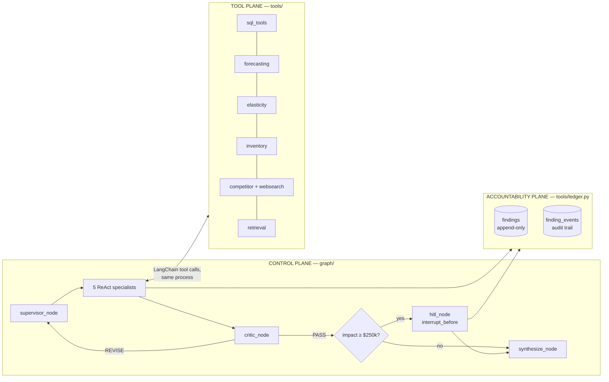

# 🏗️ Karma Edge — Technical Architecture

For engineers. The [README](README.md) explains *why*; this explains *how*, precisely enough to extend or fork it.

**Stack:** LangGraph `StateGraph` · LangChain native tool calling · `langchain-openai` against OpenAI-compatible Chinese model APIs · SQLite · BM25 (Chroma optional) · **no MCP, no local model weights, no paid vector DB.**

---

## 1. Three planes



**Why no MCP.** MCP buys you cross-language tool servers and process isolation. This system is one Python process on a laptop, and the tools are numpy-free pure-Python functions over the same SQLite file the agents query. MCP would add a transport, a server lifecycle, and a serialization boundary to buy nothing. `@tool` decorated functions give the LLM the identical JSON-schema contract with zero infrastructure — and you can set a breakpoint inside a forecast.

---

## 2. State schema — `graph/state.py`

One `TypedDict` flows through every node. Reducers matter:

```python
class KarmaState(TypedDict, total=False):
    messages:  Annotated[Sequence[BaseMessage], add_messages]   # accumulates
    question: str
    run_id: str

    next_agent: str                      # supervisor's routing decision
    route_reason: str
    visited: Annotated[List[str], operator.add]   # accumulates: loop diagnostics

    iteration: int                       # critique-loop counter
    verdict: str                         # PASS | REVISE | ""
    critic_confidence: float
    critic_issues: List[str]             # itemised A–G failures
    critic_next: List[str]               # explicit instruction for the next pass

    draft: str
    final: str
    findings: Annotated[List[Dict], operator.add] # accumulates: never overwritten

    hitl_required: bool
    hitl_reason: str
    hitl_decision: Optional[str]         # approve | reject | None
```

Three fields use additive reducers (`add_messages`, `operator.add`) because they are **evidence**: message history, the path taken, and the findings produced. Everything else is last-write-wins control state. `findings` being additive is a deliberate accountability property — a later node cannot silently drop an earlier agent's finding.

---

## 3. Control flow — `graph/supervisor.py`

```python
g = StateGraph(KarmaState)
g.add_node("supervisor", supervisor_node)
for name in SPECIALISTS:            # data_analyst, forecaster, pricing_strategist,
    g.add_node(name, make_specialist_node(name))   # competitor_intel, accountability
g.add_node("critic", critic_node)
g.add_node("hitl", hitl_node)
g.add_node("synthesize", synthesize_node)

g.set_entry_point("supervisor")
g.add_conditional_edges("supervisor", route_from_supervisor,
                        {**{s: s for s in SPECIALISTS}, "critic": "critic"})
for s in SPECIALISTS:
    g.add_edge(s, "critic")
g.add_conditional_edges("critic", route_from_critic,
                        {"supervisor": "supervisor", "hitl": "hitl",
                         "synthesize": "synthesize"})
g.add_edge("hitl", "synthesize")
g.add_edge("synthesize", END)

graph = g.compile(checkpointer=MemorySaver(), interrupt_before=["hitl"])
```

### Routing contract

The supervisor is prompted to emit a single machine-parsed line:

```
ROUTE: pricing_strategist
WHY: markdown depth is the suspected driver; need elasticity before assigning owner
```

`route_from_supervisor` parses `ROUTE:`, validates it against the specialist registry, and falls through to `critic` on `FINISH` or on any unparseable output. **Parse failure is never fatal** — a garbled route from a small free model degrades to "go get audited," not a crash. That is a hard requirement when the target models are 7B-class free tiers.

### The critique loop

```
supervisor → specialist → critic
                            ├─ REVISE and iteration < MAX_CRITIQUE_ITERATIONS → supervisor
                            │      (critic_issues + critic_next injected into its prompt)
                            ├─ PASS and any finding ≥ HITL_DOLLAR_THRESHOLD → hitl
                            └─ otherwise → synthesize
```

`iteration` increments in `critic_node`. On reaching the cap the graph ships anyway, with unresolved issues **printed in the final answer** — a system about accountability does not get to fail silently. `GRAPH_RECURSION_LIMIT=60` is LangGraph's own super-step ceiling and is set well above `10 × 2` hops so the cap logic, not the framework, decides when to stop.

### Critic verdict format

```
VERDICT: REVISE
CONFIDENCE: 0.45
ISSUES:
- A: the "$4.1M leak" appears in no tool output in this transcript
- E: Q4 decline not separated from seasonality
NEXT:
- route to forecaster to establish a seasonal baseline
```

Parsed by regex into `verdict`, `critic_confidence`, `critic_issues`, `critic_next`. Checklist A–G is defined in `agents/prompts.py` and documented in the README.

### HITL — real interrupt, not a prompt

`interrupt_before=["hitl"]` with a `MemorySaver` checkpointer halts the graph *before* the node executes. The caller sees a pending state, presents the findings, then:

```python
graph.update_state(cfg, {"hitl_decision": "approve"})
graph.invoke(None, cfg)     # resumes from the checkpoint
```

`hitl_node` appends a `finding_events` row with the actor and the decision. Rejection is recorded, not erased — a rejected finding stays in the ledger with its rejection attached, which is the whole point.

---

## 4. Specialists — `graph/nodes.py`

Each is `create_react_agent(llm, tools, prompt=doctrine)` wrapped by a node that:

1. builds (or reuses from `_AGENT_CACHE`) the sub-agent for the **current** provider;
2. hands it the question, the accumulated transcript, and any outstanding `critic_issues`;
3. runs it under `AGENT_RECURSION_LIMIT` tool hops;
4. writes the result into `draft` and appends to `messages` and `visited`.

`reset_agent_cache()` is called by `app.llm.set_provider()`, so a runtime `/provider deepseek` rebuilds every sub-agent against the new model on its next turn. Model swap is a cache invalidation, not a restart.

| Specialist | Tool belt |
| --- | --- |
| `data_analyst` | `sql_query`, `semantic_metric`, `list_metrics`, `search_policy` |
| `forecaster` | `forecast_series`, `inventory_health`, `reorder_plan`, `sql_query` |
| `pricing_strategist` | `simulate_price_change`, `price_gap_report`, `sql_query`, `semantic_metric`, `search_policy` |
| `competitor_intel` | `discover_competitors`, `discover_catalog_urls`, `scrape_competitor`, `price_gap_report`, `sql_query` |
| `accountability` | `log_finding`, `read_ledger`, `semantic_metric`, `search_policy` |

Tool belts are **disjoint by design**. A pricing agent that can run arbitrary SQL will eventually invent its own margin definition; one that must go through `semantic_metric` cannot.

---

## 5. Tool plane — contracts

Every tool returns a **compact human-and-LLM-readable string** with its own provenance line (SQL used, model selected, observation count). That string is what the Critic audits, which is why check A (traceability) is mechanically possible at all.

### `tools/sql_tools.py` — read-only guard + semantic layer

```python
FORBIDDEN = {"insert","update","delete","drop","alter","create",
             "attach","pragma","replace","truncate","vacuum", ...}
```

`run_sql` enforces: single statement (no `;` chaining), must start with `SELECT` or `WITH`, no forbidden keyword, a hard `LIMIT` injected, connection opened `file:...?mode=ro` immutable-read. Swap the `connect()` function alone for Postgres/Snowflake/BigQuery — it is one function on purpose.

`semantic_metric(metric, dimensions, where)` compiles from `semantic/metrics.yml`:

```yaml
metrics:
  gross_margin:
    sql: SUM(revenue - cogs)
    grain: [date, sku, store, category, region]
    owner: pricing
    description: Revenue minus cost of goods sold, in dollars.
ownership:
  overstock: buying
  discount_depth: pricing
  stockout: supply_chain
  lead_time: supply_chain
  forecast_error: planning
  competitor_undercut: pricing
  assortment_error: buying
  ad_efficiency: ads
```

Dimensions are validated against the metric's declared `grain`, so an LLM cannot group revenue by a column that isn't a legal grain for it.

### `tools/forecasting.py` — embedded `Limitless_TSF`

Four estimators in pure Python: `seasonal_naive`, `holt_winters` (additive triple exponential smoothing), `double_exponential` (Holt's linear trend), `theta_method`. `select_and_forecast` holds out the tail, computes **MAPE per candidate**, and returns the winner plus its error and an 80% interval derived from holdout residual spread.

```
forecast_series(sku="SKU-1042", horizon=8, season=52)
→ model=holt_winters  holdout_MAPE=11.3%  next8=[...]  lo80/hi80=[...]
```

If `limitless_tsf` (and `statsmodels`) are importable, the real ARIMA/Prophet/XGBoost engines are used instead — the tool signature and output contract are unchanged, so nothing upstream cares.

### `tools/elasticity.py` — embedded `PricePulse`

`estimate_elasticity(sku)` builds a log-log OLS design matrix — `ln(units) ~ ln(own_price) + ln(competitor_price) + promo_flag` — solved with a hand-rolled Gaussian-elimination normal-equations solver (no numpy required). Returns own elasticity, cross elasticity, R², and **n**. `optimize_price` grid-searches price within ±30% for maximum expected profit under an inventory-cover constraint.

`simulate_price_change` refuses to sound confident on thin data: it emits the observation count, and the pricing doctrine plus critic check D flag any elasticity fitted on `n < 12`.

### `tools/competitor.py` — the autonomous agent, nothing hardcoded

Grep the file: there is no competitor name, no domain, and no CSS selector. The pipeline:

| Stage | Mechanism | Fallback |
| --- | --- | --- |
| `discover_competitors` | Tavily if `TAVILY_API_KEY`, else keyless DuckDuckGo HTML endpoint; strips aggregators/marketplaces/social; ranks domains by mention frequency | returns empty and says so |
| `discover_catalog_urls` | `robots.txt` → `sitemap.xml` (incl. nested indexes) → `<loc>` harvest → keyword-score against the category | homepage `<nav>` link walk |
| `extract_products` | 1. schema.org **JSON-LD** `Product` walk (exact, selector-free) → 2. **LLM-guided** parse of cleaned page text → 3. regex price sweep | reports failure, never fabricates |
| `match_to_internal` | `difflib.SequenceMatcher` against our product names, cutoff 0.52, **confidence reported per row** | unmatched rows kept as unmatched |
| `persist` | upsert into `competitor_prices` with `observed_at` | — |

Politeness is structural: `_polite(host, min_gap=1.5)` enforces a per-host delay, a declared user agent is sent, and sitemaps are preferred over crawling. For JS-rendered sites, add Playwright behind `extract_products` — that's the single extension point; nothing else changes.

### `tools/retrieval.py` — vectorless-first

`RETRIEVAL_MODE=bm25` (default) chunks `knowledge/*.md` on headings and ranks with `rank-bm25` — zero native deps, zero embedding cost, and better than vectors on structured policy text where the query shares the document's vocabulary. `RETRIEVAL_MODE=chroma` swaps in a local persistent Chroma collection with its default local embedder. Same tool signature either way.

### `tools/ledger.py` — append-only

`findings` is insert-only. Mutation happens as appended `finding_events(finding_id, actor, action, note, ts)` rows. `owner_for(dimension)` reads the `ownership:` map — the LLM supplies the *dimension* of the failure, the map supplies the *owner*. That indirection is why an agent cannot assign a leak to "the market": there is no such key.

---

## 6. Model plane — `app/llm.py`

```python
ProviderSpec(key, label, base_url, default_model, api_key_env, models, signup)
```

Seven providers: `zhipu`, `deepseek`, `qwen`, `moonshot`, `siliconflow`, `openrouter`, `fake`. Every real one is OpenAI-protocol-compatible, so all seven are constructed as `ChatOpenAI(base_url=..., api_key=..., model=...)` — **native tool calling, no custom adapter**, which is exactly why this design avoids Chinese-provider-specific SDKs.

`set_provider(provider, model)` mutates process settings, validates the key is present, and calls `reset_agent_cache()`. Exposed as `/provider <name> [model]` in the CLI and as the Streamlit sidebar picker. Provider swap is live, mid-conversation, mid-graph.

### `app/fake_llm.py` — deterministic offline model

`ScriptedChatModel` is a real `BaseChatModel`. Given supervisor-style input it emits `ROUTE:` lines following a fixed path (`data_analyst → forecaster → pricing_strategist → accountability → FINISH`); given critic-style input it emits a `VERDICT:` block; given a specialist role it **keyword-maps the question to a genuine tool call**, executes it, and returns the real tool output. So `MODEL_PROVIDER=fake` exercises the entire graph, every reducer, the SQL guard, the forecaster, and the ledger — with **no API key and no network**. That's what the 9 tests in `tests/test_smoke.py` run against, and why CI is free and deterministic.

---

## 7. Data plane — `data/schema.sql`, `data/seed.py`

Tables: `products`, `stores`, `sales`, `inventory`, `purchase_orders`, `competitor_prices`, `ad_spend`, `gl_entries`, `cashflow`, plus the view `v_sales_margin` that every margin tool reads.

`seed.py` generates 18 months of daily data with **planted saboteurs**, so the agents have real signal to find:

| Planted failure | Expected dimension | Expected owner |
| --- | --- | --- |
| Small-appliance over-buy → discount deepening 18%→30% over 6 months | `overstock` | `buying` |
| Chronic footwear hero-SKU stockouts with long lead times | `stockout` | `supply_chain` |
| Snow boots allocated to a warm region | `assortment_error` | `buying` |
| Two hero SKUs undercut by a competitor for months | `competitor_undercut` | `pricing` |
| Ad spend concentrated on already-selling SKUs | `ad_efficiency` | `ads` |

A correct run should surface these with the right dimension **and** the right owner. That's the system's own regression test.

---

## 8. Configuration — `app/config.py`

| Env var | Default | Effect |
| --- | --- | --- |
| `MODEL_PROVIDER` | `fake` | Provider key |
| `MODEL_NAME` | provider default | Model id |
| `MAX_CRITIQUE_ITERATIONS` | `10` | Critique-loop cap. **Biggest token lever.** |
| `HITL_ENABLED` | `true` | Enables the interrupt gate |
| `HITL_DOLLAR_THRESHOLD` | `250000` | Annualised impact that triggers the gate |
| `AGENT_RECURSION_LIMIT` | `30` | Tool hops per specialist turn |
| `GRAPH_RECURSION_LIMIT` | `60` | LangGraph super-step ceiling |
| `RETRIEVAL_MODE` | `bm25` | `bm25` or `chroma` |
| `TAVILY_API_KEY` | — | Better competitor search; DDG used if unset |
| `LLM_TIMEOUT` | `120` | Per-call timeout, seconds |

Nothing is hardcoded to a path outside the repo root.

---

## 9. Extension points

| You want to… | Change exactly this |
| --- | --- |
| Use a real warehouse | `connect()` in `tools/sql_tools.py` |
| Add a metric or change ownership | `semantic/metrics.yml` |
| Add a specialist (e.g. the Ads agent) | add a doctrine in `agents/prompts.py`, a tool belt entry in `graph/nodes.py::SPECIALISTS`; conditional edges wire themselves from the registry |
| Add a tool | new `@tool` in `tools/`, add to one specialist's belt. That's it — no server, no manifest |
| Scrape JS-rendered sites | wrap Playwright behind `extract_products()` in `tools/competitor.py` |
| Add another model provider | one `ProviderSpec` in `app/llm.py`, if it's OpenAI-compatible |
| Tighten or loosen the audit | the A–G checklist in `agents/prompts.py::CRITIC_PROMPT` |
| Persist runs across restarts | swap `MemorySaver()` for `SqliteSaver` in `graph/supervisor.py` |

---

## 10. Known limits

- **Small free models degrade the critique loop.** 7B-class models produce shallower `ISSUES` lists. Routing and parsing are hardened against garbled output, but audit *quality* tracks model quality. Use `glm-4-plus` or `deepseek-chat` for anything you'd actually show a CFO.
- **The forecaster is univariate.** No promo/holiday regressors in the pure-Python path; install `limitless-tsf` for that.
- **Elasticity is observational OLS.** No instrument, no experiment — endogeneity is real, which is why `n` and R² are always reported and check D exists.
- **SKU matching is fuzzy string matching.** 0.52 cutoff, confidence always reported. A GTIN/UPC join would be strictly better if you have one.
- **`MemorySaver` is in-process.** Restart loses checkpoints; a pending HITL interrupt does not survive a restart. Use `SqliteSaver` for anything real.
- **The Ads/OOH agent from the original concept isn't built.** The ownership map reserves `ads` and `placement`; it's a sixth specialist away.
