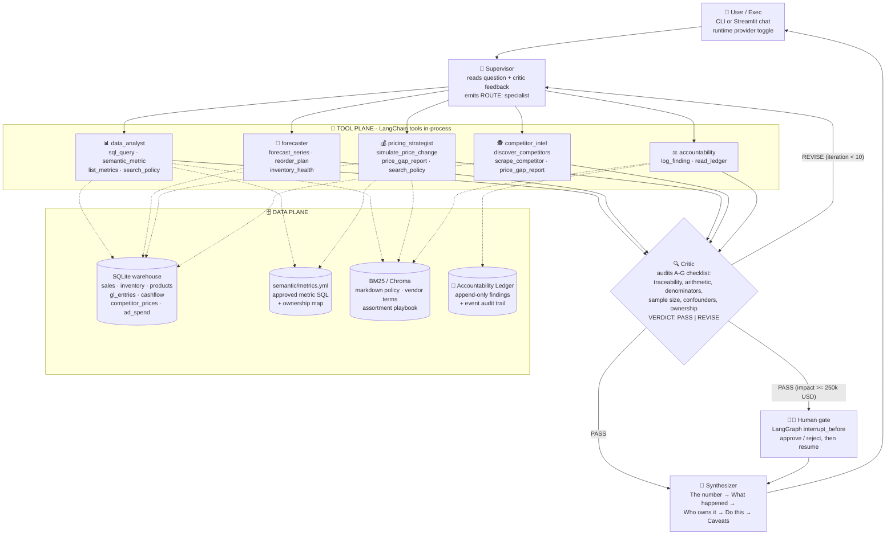
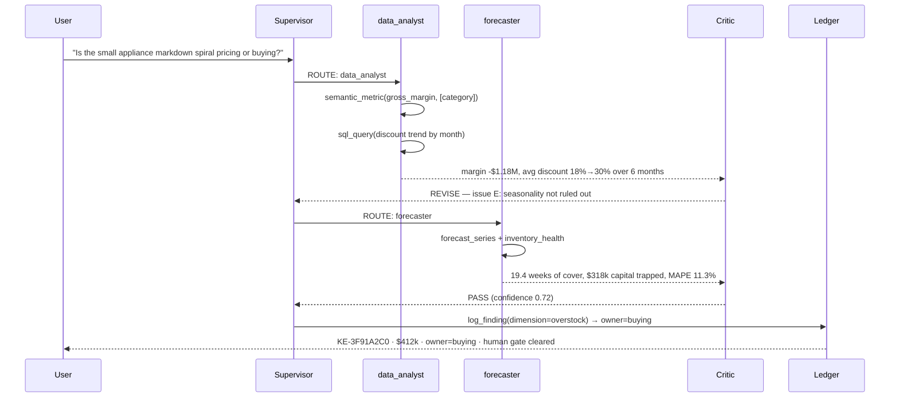

# ⚡ Karma Edge AI
### *The agentic AI platform that catches the Shakuni(cunning perpetrator) of your value chain scheming in the shadows before your P&L becomes the next casualty.*

Every retail chain houses comfortable chaos-creators quietly incinerating profitability while blaming macroeconomic headwinds. Cute narrative. 

Karma Edge uncovers the real culprits before a spreadsheet error metastasizes into front-page PnL disaster.

**Manufacturers win, suppliers win, and retailers inherit the crumbs, the losses, and an emergency strategy restructure because: chaos always pays someone.**

The only real issue is whether proactive engineering can dethrone the actors hiding behind their untouchable status and their self-issued "no accountability" crown, before it spirals into a full-blown blame-game war


<p align="center">
  
  
  
  
  
  
  
</p>

---

## 🎯 For the C-Suite (Read This First, Then Panic Productively)

Here's an inconvenient truth retailers don't put in their annual report: **Manufacturers and Sellers keep flexing their YoY PAT growth blockbuster numbers while some Retailers biggest achievement is turning EBIDTA positve.

Why? Because retail is the only part of the value chain where *nobody owns the outcome*. 

- The **S&OP plan** that forecasted demand for a store using a spreadsheet and vibes.
- The **product mix** curated in complete defiance of local demand signals and category cost-to-serve, leaving the commercial team zero strategic choice but to trigger margin-torching fire sales just to liquidate deadweight inventory.
- The **store location** that looked brilliant on a slide deck and utterly catastrophic on a map, completely ignoring competitor proximity, brutal sales cannibalization, near-zero street visibility, and a local demographic that had zero affinity for the brand.
- The **pricing** that's either scaring customers off or leaving money on the table and nobody's sure which.
- The absent **ads vertical**, which can be profitable from get go. It's not the retailer's responsibility to drive product demand. Brands should pay the retailer to increase demand, and the ads/in-house marketing vertical should strive to deliver best ROAS.
- The **fulfilment lead times** on your top SKUs that are quietly training your best customers to shop somewhere else.

None of these show up as a single "bad decision." They show up eighteen months later as a margin miss, a customer service score in freefall, and a PR headline nobody wanted. That's not bad luck but 
**an accountability vaccum**, and vaccums like that don't stay empty. Something always moves in to fill them, and it's rarely good news.

**Karma Edge exists to close that vaccum.** It's a multi-agent AI system that continuously interrogates your sales, inventory, pricing, cashflow, competitor, and ad-spend data the same way a forensic accountant would and assigns **margin accountability down to the SKU level**. Every dollar of margin has an owner. Every risk has a name. Every "we didn't see it coming" excuse gets a lot harder to make.

Because in the end, the question was never complicated: **will the right product be bought, priced, placed, and delivered profitably?** Karma Edge just makes sure the answer is visible before the finance team has to ask it in a very uncomfortable meeting.

> *What goes around, comes around. Karma Edge just gets there faster than your quarterly review.*

---

## 🧠 What Karma Edge Actually Does

Karma Edge is an open-source, LangGraph/LangChain multi-agent chatbot that sits on top of your retail data stack and answers natural-language questions like:

- "Why is Category X's margin down 8% this quarter?"
- "What's our cashflow risk next quarter if Competitor Z cuts prices 10%?"
- "Which SKUs are at stockout risk in the next 14 days?"
- "Is the small appliance markdown spiral a pricing problem or a buying problem?"
- "Go find out who our competitors are in small kitchen appliances, scrape their catalog, and tell me where we're being undercut."
- "What are the inefficiencies in supply chain and how do I optimize cost to serve?"

It does this by routing questions through specialized agents, treating every generated number as a hypothesis until a **Critic** agent audits it, forecasting forward with the **embedded** `Limitless_TSF` model family, pulling elasticity from the **embedded** `PricePulse` estimator, autonomously researching and scraping competitors and when things don't add up it loops back on itself like a stubborn analyst before ever bothering a human.

Then it does the one thing dashboards never do: **it writes a name next to the number.**

### Three design decisions worth knowing up front

| Decision | What it means | Why |
| --- | --- | --- |
| **No MCP. No sidecars.** | Every tool is a LangChain `@tool` Python function running in the same process. Forecasting, elasticity, SQL, scraping — all in-process function calls. | One `pip install`, one process, zero servers to babysit. You can breakpoint into the forecast. |
| **No local model weights.** | Every model is a hosted, OpenAI-compatible API: Zhipu GLM, DeepSeek, Qwen, Kimi, SiliconFlow, OpenRouter. All have free tiers. | It runs on a 2015 MacBook Air with 8GB of RAM. No Ollama, no 40GB of GGUF, no fan noise. |
| **No paid vector DB.** | BM25 (pure Python) and Local Chroma are the retrievers |  It costs nothing. |

---

## 🏗️ Architecture Overview

Karma Edge is a **supervisor-orchestrated multi-agent graph** in LangGraph, with three planes: a **control plane** that routes and audits, a **tool plane** of embedded Python functions, and an **accountability ledger** that is append-only so findings cannot be quietly rewritten.





### The critique loop, in one sentence

The Supervisor routes, a specialist produces numbers with tools, the Critic tries to break them, and only numbers that survive up to **10 rounds** of that get a name attached and land in the ledger — with a **human gate** for anything at or above $250k of annualised impact.



### Retrieval philosophy: hybrid, vectorless-first

Karma Edge doesn't default to "embed everything." Following a vectorless-RAG-first design, each query is **routed** to the retriever that actually fits it:

| Query type | Retriever used | Why |
|---|---|---|
| "What was margin for SKU X last week?" | `semantic_metric` / `sql_query` | Structured, exact answer needed |
| "What does the markdown policy say about small appliances?" | BM25 keyword over markdown policy docs | Structured doc, no need for embeddings |
| "Summarize competitor pricing narrative for Brand Y" | Live fetch + long-context read (Chroma optional) | Unstructured, fuzzy, paraphrase-heavy |
| "Which SKUs are at stockout risk?" | `sql_query` + `forecast_series` + `inventory_health` | Numeric + predictive |

Vectors are the *fallback*, not the default — set `RETRIEVAL_MODE=chroma` only when your corpus is genuinely unstructured. Chroma runs locally and free; nothing is sent to a paid embedding API.

---

## 🕵️ The Critique Loop: Karma Edge's "Lie Detector"

Every number an LLM produces is a hypothesis, not a fact. The Critic (`graph/nodes.py::critic_node`) audits the transcript against a fixed checklist and returns a machine-parsed verdict:

| # | Check | Failure it catches |
|---|---|---|
| **A** | **Traceability** — is every dollar figure traceable to a tool result in this transcript? | Hallucinated numbers. The single most common LLM-analytics failure. |
| **B** | **Arithmetic** — do stated totals follow from stated components? | "$4.1M leak" that is actually the sum of three overlapping subsets. |
| **C** | **Denominators** — any rate on a near-zero base? Divide-by-zero risk? | "Margin rate down 4,000%" on a store that sold six units. |
| **D** | **Sample size** — elasticity on <12 observations, forecast on <8 periods? | Confident price recommendations built on four data points. |
| **E** | **Confounding** — is the claimed cause just seasonality, mix shift, or a store opening? | Blaming Pricing for a calendar shift. |
| **F** | **Ownership** — exactly one function named, consistent with policy docs? | "Cross-functional issue", i.e. nobody's problem. |
| **G** | **Actionability** — is the recommendation a specific action with a number? | "Optimize the assortment." |

It returns `VERDICT: PASS | REVISE`, a confidence, itemised issues, and an explicit next instruction. `REVISE` sends the state **back to the Supervisor** with those issues attached, so the next specialist gets told exactly what to fix. Iteration is capped at `MAX_CRITIQUE_ITERATIONS=10`; on cap it ships **with the unresolved issues printed in the answer** rather than looping forever. Silence is not an option.

Escalation to a human uses LangGraph's real interrupt mechanism — `interrupt_before=["hitl"]` plus a `MemorySaver` checkpointer — so execution genuinely halts, the findings are shown, and `graph.update_state(...)` + `graph.invoke(None, cfg)` resumes with the human's decision recorded.

---

## 🧩 Meet the Agents

Each specialist is a LangGraph **ReAct sub-agent** (`create_react_agent`) with its own system doctrine and its own tool belt. They cannot reach each other's tools — that's the point.

### 📊 data_analyst
Read-only SQL over the warehouse plus a **semantic metric layer**. Won't invent column arithmetic: metrics are defined once in `semantic/metrics.yml` and compiled from there, which is precisely why the Critic can tell a broken JOIN from a real business shock. Reports rate **and** dollars, always, because margin rate can improve while margin dollars collapse.

**Tools:** `sql_query` (SELECT-only, statement-guarded, single-statement) · `semantic_metric` · `list_metrics` · `search_policy`

### 🔮 forecaster
Owns every forward-looking number. Embeds the [`Limitless_TSF`](https://github.com/rajesh04jena/Limitless) model family: Holt-Winters (additive triple exponential smoothing), seasonal naive, Theta(0,2), and Holt's linear trend — with **automatic model selection by holdout MAPE**, not by vibes. If you `pip install limitless-tsf` (and `statsmodels`), the real ARIMA/Prophet/XGBoost engines take over transparently; the tool contract never changes. Every forecast reports its selected model, its backtest error, and an 80% interval. A forecast without an error estimate is an opinion.

**Tools:** `forecast_series` · `reorder_plan` (lead-time-aware reorder point and order quantity) · `inventory_health` (weeks of cover, stockout risk, trapped capital in dollars) · SQL

### 💰 pricing_strategist
Embeds [`PricePulse`](https://github.com/rajesh04jena/PricePulse): a log-log OLS self/cross elasticity estimator (the same estimator PricePulse uses to build its Bayesian priors) plus a constrained profit-maximising price search under an inventory cap. It reports observation count and R² so you can tell an estimate from a guess. Critically, it enforces the doctrine in the markdown policy: **three consecutive months of deepening discount is a buy-quantity error, and ownership moves to Buying.** Pricing does not get charged for someone else's over-buy.

**Tools:** `simulate_price_change` · `price_gap_report` · `sql_query` · `semantic_metric` · `search_policy`

### 🕵️ competitor_intel — *fully autonomous, nothing hardcoded*
This is where Karma Edge stops being a dashboard. There is **no competitor domain, no CSS selector table, and no retailer name anywhere in the source.** The agent runs its own research loop:

```
discover_competitors(retailer, market, category)
        ↓  keyless DuckDuckGo (Tavily if you have a key), aggregator-filtered,
        ↓  domains ranked by mention frequency
discover_catalog_urls(domain, category)
        ↓  robots.txt → sitemap.xml → <loc> harvest, keyword-scored,
        ↓  homepage nav walk as fallback
scrape_competitor(competitor, urls)
        ↓  1. schema.org JSON-LD Product extraction (exact, no selectors)
        ↓  2. LLM-guided parse of raw page text (works on sites nobody has seen)
        ↓  3. regex price sweep (last resort)
        ↓  difflib fuzzy match onto our SKUs, with a reported confidence
        ↓  persisted to competitor_prices
price_gap_report()
        ↓  ours vs theirs, % gap, observation count
```

Polite by construction: one request per host per 1.5s, a declared user agent, sitemaps preferred over crawling. If a site is JS-rendered or blocks us, the agent is instructed to **say so** rather than invent prices. A 0.55 fuzzy match is reported as a hypothesis, not a fact.

### ⚖️ accountability
Converts analysis into named, dollar-quantified findings in the **append-only Accountability Ledger**. Reads the ledger first so the same leak isn't rediscovered with a fresh name every quarter. The owning function is **derived from the finding's dimension** via the ownership map in `semantic/metrics.yml` — so the agent structurally cannot assign a margin leak to "the market."

```
overstock, assortment_error → buying        discount_depth, price_position → pricing
stockout, lead_time         → supply_chain  competitor_undercut            → pricing
forecast_error              → planning      ad_efficiency, placement       → ads
```

---

## 📒 The Accountability Ledger — Where the Blame Finally Lands

Two tables, `findings` and `finding_events`, in their own SQLite file. Findings are **never updated in place**; status changes are appended as events with an actor and a timestamp. Every row carries:

| Column | Why it exists |
| --- | --- |
| `dollar_impact` | Annualised margin at stake. Findings sort by this, so the meeting starts with the biggest number. |
| `owner_function` | Derived, not chosen. One name. |
| `confidence` | Must reflect evidence depth — thin elasticity, short history, or weak SKU matching all pull it down. |
| `evidence` | The queries and arithmetic behind the number. Argue with the evidence, not the agent. |
| `recommendation` | One action, with a number in it. |
| `finding_events` | Full audit trail: created → critiqued → approved/rejected → closed. |

`python -m app.main ledger` dumps it as JSON. Point Metabase at the file if you want executives to watch their own accountability accrue in real time.

---

## 🗂️ Repository Structure

```
karma-edge/
├── README.md                     # you are here
├── SETUP.md                      # MacBook setup, step by step, including free API keys
├── ARCHITECTURE.md               # deep technical dive: state, control flow, extension points
├── PROMPTS.md                    # 15 example prompts with what each should exercise
├── requirements.txt
├── Makefile                      # make setup / seed / test / demo / chat / ui
├── .env.example
│
├── app/
│   ├── config.py                 # env-driven settings, zero hardcoded paths
│   ├── llm.py                    # 7-provider factory + runtime set_provider()
│   ├── fake_llm.py               # deterministic offline model: no keys, no network
│   ├── main.py                   # CLI chatbot with /provider, /ledger, /providers
│   └── ui.py                     # optional Streamlit chat + provider picker sidebar
│
├── graph/
│   ├── state.py                  # KarmaState TypedDict + LangGraph reducers
│   ├── nodes.py                  # supervisor · 5 ReAct specialists · critic · hitl · synth
│   └── supervisor.py             # StateGraph assembly, conditional edges, checkpointer
│
├── agents/
│   └── prompts.py                # system doctrine per agent (evidence rules live here)
│
├── tools/                        # ALL tools are plain @tool functions. No MCP.
│   ├── sql_tools.py              # read-only SQL guard + semantic metric compiler
│   ├── forecasting.py            # Limitless_TSF models, embedded + auto-selected
│   ├── elasticity.py             # PricePulse elasticity + profit-optimal price
│   ├── inventory.py              # weeks of cover, stockout risk, reorder planning
│   ├── competitor.py             # autonomous discovery → catalog → scrape → match
│   ├── websearch.py              # keyless DDG search + polite fetch + JSON-LD
│   ├── retrieval.py              # BM25 default, local Chroma optional
│   └── ledger.py                 # append-only accountability ledger
│
├── semantic/
│   └── metrics.yml               # approved metric SQL + the ownership map
│
├── knowledge/                    # BM25/Chroma corpus
│   ├── markdown_policy.md        # discount caps, escalation ownership doctrine
│   ├── assortment_playbook.md    # climate-fit rule, cover targets, lead-time discipline
│   └── vendor_terms.md           # markdown support, MOQs, claim windows
│
├── data/
│   ├── schema.sql                # warehouse DDL + v_sales_margin
│   └── seed.py                   # 18 months of synthetic data with planted saboteurs
│
└── tests/
    └── test_smoke.py             # 9 offline tests, no keys, no network
```

---

## ⚙️ Free Model Options (all hosted, all OpenAI-compatible, no local weights)

Every provider below speaks the OpenAI chat-completions protocol, which means LangChain's `ChatOpenAI` talks to it **with native tool calling** and zero custom adapter code. Switch between them **at runtime** with `/provider deepseek` in the chat, or from the Streamlit sidebar.

| Provider | Key env var | Free / cheap model | Tool calling | Notes |
|---|---|---|---|---|
| **Zhipu AI (GLM)** ⭐ | `ZHIPU_API_KEY` | `glm-4-flash` | ✅ solid | Genuinely free tier, generous limits. Best default. |
| **DeepSeek** | `DEEPSEEK_API_KEY` | `deepseek-chat` | ✅ solid | Strongest reasoning per cent. Signup credits. |
| **Alibaba Qwen** | `DASHSCOPE_API_KEY` | `qwen-plus`, `qwen-turbo` | ✅ | Free trial quota per model. Use the `-intl` endpoint outside mainland China. |
| **Moonshot / Kimi** | `MOONSHOT_API_KEY` | `moonshot-v1-8k` | ✅ | Trial credits; long-context variants are handy. |
| **SiliconFlow** | `SILICONFLOW_API_KEY` | `Qwen/Qwen2.5-7B-Instruct` | ⚠️ varies | One key, many free Chinese open models. |
| **OpenRouter** | `OPENROUTER_API_KEY` | `deepseek/deepseek-chat-v3-0324:free` | ⚠️ varies | Aggregator; `:free` variants rotate and rate-limit. |
| **`fake` (built-in)** | none | `scripted-analyst` | ✅ simulated | Deterministic offline stub. Runs the whole graph with no key and no network. |

> **Recommended pairing for a 10–15 prompt test session on an old MacBook:** `glm-4-flash` for routing and critique (free, fast), `deepseek-chat` for the heavy pricing/competitor reasoning. Start on `fake` to confirm the graph and the data are wired up before you spend a single token.

**No Ollama. No GGUF. No local weights.** The heaviest thing this repo asks your laptop to do is a Holt-Winters fit in pure Python.

---

## 🚀 Quickstart (macOS, 5 minutes)

```bash
git clone https://github.com/rajesh04jena/karma-edge.git
cd karma-edge

python3 -m venv .venv && source .venv/bin/activate
pip install -r requirements.txt

cp .env.example .env          # MODEL_PROVIDER=fake works with zero keys

python -m data.seed           # build the demo warehouse (18 months, planted leaks)
python -m pytest -q           # 9 offline tests, no network
python -m app.main            # chat
```

In the chat:

```
you > /providers
you > /provider zhipu                 # or deepseek / qwen / moonshot / siliconflow / openrouter
you > Which category is losing the most gross margin, and who owns it?
you > /ledger
```

Prefer a browser? `pip install streamlit && streamlit run app/ui.py` — the sidebar has the provider picker.

**Full step-by-step MacBook instructions, including where to get each free API key and how to fix the five errors you're most likely to hit → [SETUP.md](SETUP.md)**
**Fifteen ready-to-paste example prompts, and what each one is designed to exercise → [PROMPTS.md](PROMPTS.md)**
**Full technical deep dive: state schema, control flow, tool contracts, extension points → [ARCHITECTURE.md](ARCHITECTURE.md)**

---

## 🔌 Plugging In Your Own Data

Three files, in this order:

1. **`data/schema.sql`** — point the tables at your warehouse, or keep the shape and load your own rows. Keep `v_sales_margin`; every tool reads it.
2. **`semantic/metrics.yml`** — redefine metrics in your language, and edit the `ownership:` map so findings land on the functions **your** org actually has.
3. **`knowledge/*.md`** — drop in your real markdown policy, vendor terms, and playbooks. This is what lets an agent say "this violates section 3" instead of "discounting seems high."

For a real warehouse (Postgres, Snowflake, BigQuery), replace the `connect()` function in `tools/sql_tools.py` with your driver. Everything upstream of that one function is unchanged, because it was designed to be one function.

---

## 🧪 What's Real vs. What's a Stub

Honesty, since the whole project is about accountability:

| Component | Status |
| --- | --- |
| LangGraph supervisor graph, routing, conditional edges, checkpointing | **real, tested** |
| Critique loop with parsed verdicts and 10-iteration cap | **real, tested** |
| HITL interrupt + resume with recorded decision | **real, tested** |
| Read-only SQL guard + semantic metric compiler | **real, tested** |
| Forecasting with backtested auto model selection | **real, tested** (pure-Python ports; install `limitless-tsf` for ARIMA/Prophet/XGBoost) |
| Elasticity + profit-optimal price | **real, tested** (OLS log-log; install `PricePulse` for the hierarchical Bayesian fit) |
| Inventory health, reorder planning | **real, tested** |
| Append-only ledger with ownership derivation | **real, tested** |
| BM25 retrieval over policy corpus | **real, tested** |
| Autonomous competitor discovery + scraping | **real**, network-dependent — untested in CI by design; JS-heavy sites need Playwright (see ARCHITECTURE.md) |
| Demo warehouse data | **synthetic**, with deliberately planted saboteurs so the agents have something to find |
| Ads / OOH agent from the original concept | **not built yet** — the ownership map reserves `ads` and `placement`; wire it as a sixth specialist |

---

## 📜 License

MIT — because accountability shouldn't be proprietary.

---

*Karma Edge doesn't predict the future. It just makes sure nobody's margin disappears without a name attached to it.*
